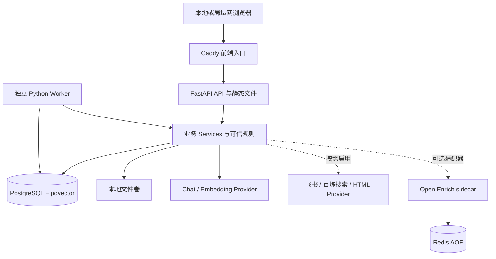
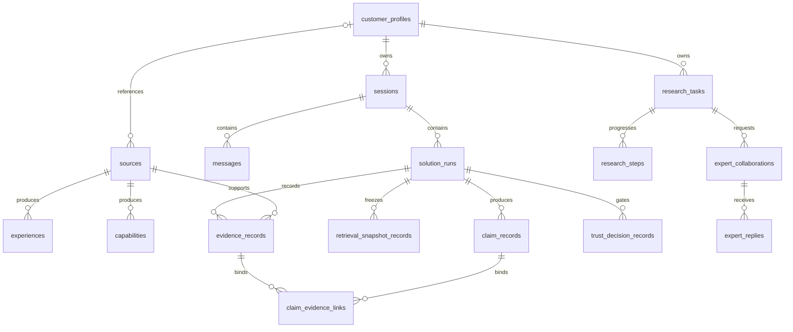
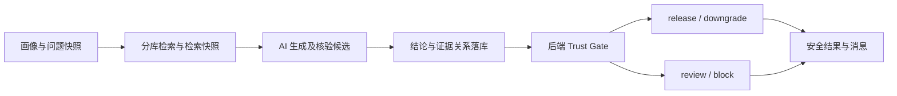

# 淘到宝引擎：项目架构与数据架构报告

编写日期：2026-09-28

代码基线：个人仓库 `TTJTR/taodaobao-engine`，提交 [`a0fd88e`](https://github.com/TTJTR/taodaobao-engine/tree/a0fd88e)

适用读者：产品、开发、技术面试官，以及准备接手部署和企业化改造的团队。

> 本报告依据当前代码、ORM 模型、迁移和部署文件整理。“已实现”表示存在对应代码路径，不等于本次已完成真实模型联调、性能压测或生产安全验收。云端历史环境不属于本次核验范围。本文只整理架构，不修改业务实现和冻结契约。

## 1. 结论：这是一个带可信治理的售前工作系统

淘到宝引擎面向企业销售与售前人员，把分散资料转成可审核、可检索的企业知识，再服务于客户画像、快速方案、复杂研究、专家协作、招标响应和方案演练。

它的主要价值不是增加一个聊天入口，而是回答三个问题：**这句话依据什么、这些依据现在还有效吗、谁有权把它作为企业结论发布？**

当前系统采用 **Local First 的模块化单体架构**：原生 HTML/JavaScript 前端，FastAPI 后端，PostgreSQL/pgvector 数据层，部分任务由独立 Worker 执行；Docker Compose 负责单机编排。AI 是可替换的服务适配层，不是数据库和业务规则的替代品。

现阶段适合作品集展示、本机运行和受控试点，不能直接定义为多租户、高可用的企业生产服务。尤其需要注意：

- 数据库中有任务状态，不代表所有任务都具备自动故障恢复。Deep Research 仍使用 API 进程内的 `BackgroundTasks`。
- 快速方案有明确的后端 Trust Gate；不能把这一实现泛化为所有模块已经使用同一套发布门禁。
- Local First 表示业务和数据可以部署在本地，不表示默认模型、飞书和搜索可以断网运行。
- `workspace_id` 查询过滤是隔离基础，不等于完整 RBAC、数据库行级安全或企业租户治理。

## 2. 产品架构：围绕同一客户和同一证据体系工作

| 层次 | 模块 | 主要输入与输出 | 人的责任 |
|---|---|---|---|
| 知识准备 | 资料库、历史经验、原子能力 | 原始资料 → 提取草稿 → 已审核资产 | 确认来源、审核资产 |
| 客户理解 | 长期客户画像、情报 Proposal | 资料/情报 → 待确认变更 → 画像版本 | 确认画像变更 |
| 决策生成 | 快速方案、Deep Research | 画像 + 可信资产 + 问题 → 方案/报告 | 处理风险、知识缺口与审核项 |
| 协同补证 | 专家协作 | 研究上下文 → 专家问题 → 回复 | 确认专家、判断回复是否可采纳 |
| 业务应用 | 情报招标、方案演练 | 要求/情境 → 响应矩阵/演练报告 | 审核响应、识别危险承诺 |
| 交付表达 | 展示稿、互动 HTML | 研究或方案上下文 → 可演示产物 | 确认事实、安全和展示效果 |

长期画像是业务共享对象，但运行时使用快照，避免客户信息更新后，旧方案的输入被悄悄改变。专家回复和公开情报都是补充输入，不能自动升级成企业已验证能力。

资料入口仍有实现边界：核心 `SourceType` 只有 `feishu_doc` 和 `pasted_text`；招标文件和历史 PPT 有各自的解析对象。不能把产品规划中的“统一文件入口”描述成已经完成的统一底层模型。

## 3. 系统架构与部署拓扑



图中连线表示调用或依赖，不表示各服务之间存在独立微服务 API。`Services`、AI 适配和 Repository 大部分在同一 Python 应用内。

### 3.1 各组件的真实职责

| 组件 | 当前实现 | 不是 |
|---|---|---|
| 前端 | `static/index.html` 为主的原生 HTML/JS，配合 V2 页面与脚本 | React/Vue 工程 |
| 前端容器 | Caddy 反向代理到 `app:8000` | 单独构建的 SPA 静态资源服务器 |
| API | FastAPI，业务路由统一挂载到配置的 API 前缀；同时提供静态页面 | 多个独立业务微服务 |
| 业务层 | 按资料、研究、招标、演练、展示等拆分 Service | 由大模型自行决定数据库写入 |
| 数据访问 | SQLAlchemy AsyncSession、Repository、工作区过滤 | 每个模块独立数据库 |
| Worker | 轮询 `workflow_tasks`，数据库锁、租约、重试 | Celery 或 Redis 消息队列 |
| Redis | 默认 Compose 基础设施；可选 Open Enrich 的任务存储与发布订阅；API 有健康探测 | 核心业务的权威数据库或主任务队列 |
| Node 渲染器 | `sidecar/pptx-renderer` 随应用镜像打包，供 PPTX 渲染调用 | 默认 Compose 中的独立 PPTX 容器 |

证据：[应用入口](../app/main.py)、[本地 Caddy 配置](../Caddyfile.local)、[Compose](../docker-compose.yml)、[Worker](../app/services/durable_worker.py)、[Open Enrich 存储](../sidecar/open-enrich-wrapper/src/job-store.ts)。

### 3.2 代码分层

```text
static/                       产品页面、交互和 API 调用
app/api/v1/routes/            HTTP 入参、鉴权依赖、响应与任务入口
app/services/                 业务流程、可信门禁、任务执行和展示编排
app/contracts/ + app/schemas/ 冻结接口与结构化数据校验
app/ai/                       Prompt、模型客户端、AI Pipeline、Embedding
app/integrations/             飞书、公开搜索、网页及文档解析适配
app/db/                       ORM、数据库会话和 Repository
app/presentation/              事实绑定、版式、Render IR、容量与样式
alembic/                      数据库演进
scripts/ + tests/             运维入口与验证
```

这是按业务职责逐步拆分的单体，不是严格意义上的完全隔离领域架构：部分 Service 直接使用 ORM，依赖注入与业务实现也存在交叉引用。后续重构应先明确边界、补测试，再决定是否拆服务。

## 4. 数据架构：关系约束负责身份，快照负责追溯

当前 `app/db/models.py` 声明了 **55 张业务表**，不含 Alembic 的版本管理表。这里按业务域归组，而不是要求读者逐张记忆。

| 数据域 | 主要表 | 保存什么 |
|---|---|---|
| 身份与配置 | `users`、`workspace_model_connections`、`invitation_redemptions`、`invitation_redemption_uses` | 用户、工作区模型连接、邀请码兑换和使用 |
| 知识与画像 | `sources`、`experiences`、`capabilities`、`review_records`、`customer_profiles`、`customer_profile_versions` | 来源、两类资产、审核、画像及历史版本 |
| 会话与运行 | `sessions`、`messages`、`solution_runs`、`jobs`、`workflow_tasks`、`idempotency_records`、`ai_run_records` | 对话、业务运行、异步执行、重复请求治理与调用记录 |
| 可信证据 | `retrieval_snapshot_records`、`claim_records`、`evidence_records`、`claim_evidence_links`、`quality_attempt_records`、`trust_decision_records`、`human_review_records` | 当次检索、结论、证据关系、核验尝试和发布决定 |
| 研究与专家 | `research_tasks`、`research_steps`、`expert_contributions`、`expert_collaborations`、`expert_replies` | 研究状态、阶段快照、真实贡献关系和专家回复 |
| 情报 | `search_runs`、`intelligence_search_templates`、`raw_artifacts`、`intelligence_items`、`intelligence_item_artifact_links`、`intelligence_snapshots`、`profile_intelligence_proposals` | 采集任务、原始材料、情报、来源关联、冻结快照和画像提案 |
| 招标 | `tender_documents`、`tender_parse_versions`、`tender_requirements`、`tender_requirement_versions`、`response_matrices`、`response_matrix_items`、`response_matrix_item_versions` | 文档解析、要求拆解、逐项响应及版本 |
| 演练 | `rehearsal_sessions`、`rehearsal_turns`、`rehearsal_reports` | 情境、逐轮问答、评估结果 |
| 展示 | `reference_decks`、`narrative_profiles`、`style_profiles`、`style_template_versions`、`presentation_runs`、`presentation_input_snapshots`、`presentation_render_snapshots`、`html_artifacts`、`export_artifacts` | 参考风格、展示输入、渲染版本和产物 |

完整字段以 [ORM 定义](../app/db/models.py) 和 [迁移目录](../alembic/versions) 为准。

### 4.1 核心关系图

下面只展示主要外键关系，不是全量 ER 图；尤其没有把 JSON 内的逻辑 ID 画成数据库外键。



例如 `evidence_records.asset_id` 可指向不同类型的资产，`workflow_tasks.target_id` 可指向不同业务任务：它们是逻辑引用，不是指向单张表的外键。应在 Service 中校验类型、存在性和工作区一致性。

### 4.2 五类数据不能混为一谈

| 类型 | 例子 | 更新策略与原因 |
|---|---|---|
| 主数据 | 客户画像、用户、来源 | 允许受控变更；画像用版本保留历史 |
| 审核资产 | 经验、能力 | 提取草稿不等于可检索资产，需人工审核 |
| 执行数据 | Task、Run、Step | 状态随执行改变；每次运行有独立身份 |
| 运行快照 | 画像、检索、情报、展示输入 | 保存当时的内容和版本，不只保存最新对象 ID |
| 审计与产物 | 结论证据关系、门禁记录、HTML/PPTX | 解释“为什么发布”，并定位“发布了哪一版” |

快照提高可追溯性，但当前 JSONB 快照不等于数据库级不可篡改存储。若需强审计，还要增加写入权限约束、哈希链或外部审计存储、保留策略与审计访问控制。

### 4.3 存储和约束选择

- **UUID、时间戳、软删除**：多数业务对象复用 `EntityMixin`；软删除便于追溯，但不是合规意义上的彻底删除。
- **工作区隔离**：`WorkspaceMixin` 保存工作区，基础 Repository 默认带工作区与未删除条件。当前模型没有独立的完整工作区成员/角色体系，直接 ORM 查询仍需逐处审计。
- **关系型字段与 JSONB 共存**：身份、状态和关键关联结构化；画像、提取内容、报告和快照用 JSONB。优点是适应 AI 输出演进，代价是字段级查询、模式升级、报表和约束更复杂。
- **向量与资产同库**：经验、能力各有 `Vector(1024)`，便于把来源和审核条件放进一次查询。不需要额外部署向量数据库，但当前未在迁移中发现 HNSW/IVFFlat 索引。
- **版本与唯一约束**：画像版本、要求版本、响应项版本和运行快照有相应唯一键。它们防止重复版本号，不自动保证所有并发更新语义。
- **枚举是契约**：模型通过非原生 Enum/check constraint 等方式约束部分状态；新增状态必须同步迁移、Schema、接口与前端，不能只修改页面。

### 4.4 数据生命周期

来源导入后经过获取、解析、提取和待审核阶段。资产审核时记录来源版本、审核人和向量状态。来源更新后，旧来源被标记为更新，相关资产停止参与召回；删除和权限失效同样需要阻断使用。

但“发现来源已变化”和“对已知变化执行阻断”是两件事。代码中有来源状态、事件及刷新处理，不能据此承诺飞书权限变化在所有故障条件下即时同步。企业化需要补充定时复核、失联策略和发布前的权限新鲜度规则。

画像变更通过 Proposal 确认后写入版本；情报原文通过 `raw_artifacts`、内容指纹、URL 和采集时间建立溯源。招标解析保存解析器、文档 IR 和版本，响应项分别保存 AI 草稿、当前回答、证据与审核状态。

## 5. 检索架构：先确定是否允许用，再比较相关性

`RetrievalService` 分别检索历史经验和企业能力，不混用同一资产池。当前快速检索分别取经验最多 3 条、能力最多 5 条。

准入条件包括：同工作区、未删除、`verified`、向量已就绪、来源完成、来源状态 `current`，且审核时来源版本等于当前版本。

当前排序是：关键词命中优先，随后在有查询向量时按余弦距离排序，再按更新时间排序。关键词来自空白切分后的前几个词，匹配 JSON 数据的文本表达；这不是已经完成评测的中文分词检索、BM25 或成熟混合召回。返回的 `conflicts` 当前在基础检索中初始化为空，不能把它宣传为完整的自动冲突发现器。

快照保存资产内容、来源版本、审核版本、权限检查时间、匹配理由和证据定位。当前部分引用位置是 `reviewed_asset_json`，代表已审核结构化资产，并不天然等同于原始 PDF 的页码或段落。

### 向量模型切换的真实约束

Embedding 是共享 Provider，不增加第六个 `AIEngine` 方法。配置可独立指定模型、Key 和 Base URL，但数据库列是固定 1024 维。

切换模型时，即使维度相同，新旧模型的向量空间也未必可比；当前检索没有按 `embedding_version` 做严格准入过滤。因此不能只改环境变量就继续混用旧向量。建议流程：冻结写入或启用新索引版本 → 离线重算 → 相关性和维度校验 → 原子切换 → 保留可回退版本。不同维度还必须先做数据库迁移。

另有一个配置文案不一致：运行面板提示使用 `EMBEDDING_DIMENSIONS`，Provider 实际读取 `EMBEDDING_DIMENSION`。本文仅记录差异，未修改代码或契约。

证据：[检索实现](../app/services/retrieval_service.py)、[Embedding](../app/ai/embedding.py)、[运行配置路由](../app/api/v1/routes/runtime.py)。

## 6. AI 与可信发布架构

### 6.1 AI 负责生成，后端负责准入和发布

冻结的 [AIEngine](../app/contracts/ai.py) 只有五个方法：`extract_profile`、`extract_experience`、`extract_capabilities`、`extract_search_intent`、`generate_solution`。研究通过上下文中的模式与阶段复用生成能力，Embedding 单独适配。

模型客户端、结构化 Schema、AI Pipeline、后端 Service 和 Trust Gate 分担不同责任：模型提供候选内容，Schema 检查形状，检索控制可用知识，Gate 控制发布动作。Schema 合法不代表事实正确。

### 6.2 快速方案的已实现主链路



Gate 检查证据是否属于本次快照、引用能否复现、来源版本和权限是否有效、结论核验标签、冲突和时间预算等。`recommended_action` 被记录，但不直接决定动作。优先级为 `block`、`review`、`downgrade`、`release`；待处理状态还有 `pending`。

方案语句区分四类边界：

| 标记 | 含义 | 不可越过的边界 |
|---|---|---|
| `historical_fact` | 已有历史事实 | 成功案例不能自动推导为当前承诺 |
| `enterprise_capability` | 已验证企业能力 | 不能忽略适用条件和来源版本 |
| `ai_inference` | 模型分析与推断 | 不能伪装为企业事实 |
| `pending_confirmation` | 待确认信息 | 不能在交付中隐藏不确定性 |

Gate 是确定性规则，但部分核验标签仍来自 AI 核验流程。它约束流程和证据，不是“零幻觉”的数学保证。需要用真实业务评测集持续测量误放行、误拦截和高风险承诺。

证据：[快速方案 Pipeline](../app/services/solution_pipeline.py)、[Trust Gate](../app/services/trust_gate.py)、[可信 Schema](../app/schemas/trust.py)。

## 7. 长任务架构：当前存在两套执行机制

| 执行路径 | 当前机制 | 已有保障 | 尚不能承诺 |
|---|---|---|---|
| 快速方案、招标解析、部分情报和展示任务 | `workflow_tasks` + 独立 Worker | `FOR UPDATE SKIP LOCKED`、租约、尝试次数、可重试错误与退避 | 所有外部副作用 exactly-once、无限自动恢复 |
| Deep Research | API `BackgroundTasks` + `research_tasks/research_steps` | 阶段持久化、失败重试入口、已完成阶段跳过、专家等待 | API 崩溃后自动接管、统一租约与卡死任务回收 |
| 资料和画像等既有 Job | `jobs` 与对应后台执行入口 | 状态和处理结果落库 | 与 durable Worker 完全统一的执行语义 |

Worker 默认租约 360 秒，默认单进程顺序领任务；这些是代码参数，不是性能 SLA。租约过期重领属于至少一次执行思路，仍需幂等处理。当前异常路径、重试耗尽、外部副作用和超时竞争都应通过故障注入验证。

Deep Research 的阶段为 `analysis`、`planning`、`evidence_synthesis`、`route_comparison`、`fact_audit`、`final_report`，必要时等待专家。进度数字是阶段映射，不是剩余时间预测。研究复用初次证据快照，阶段结果持久化；重试只允许失败任务，若进程崩溃使任务停留运行态，需要额外恢复机制。

另一个重要差异是：研究 Pipeline 保存 AI 返回的 `audit` 和 `final_solution`，没有直接调用快速方案的 `TrustPersistenceService.persist_and_gate`。因此“存在 fact_audit 阶段”不能等价于“研究最终报告已通过同一后端 Trust Gate”。建议把研究报告发布也接入统一结论/证据模型与门禁，这是生产升级的优先项。

证据：[研究路由](../app/api/v1/routes/research.py)、[研究 Pipeline](../app/services/research_pipeline.py)、[研究服务](../app/services/research_service.py)、[Worker](../app/services/durable_worker.py)、[Job Runner](../app/services/job_runner.py)。

## 8. 专家、情报、招标和展示如何接入主线

- **专家协作**：贡献关系记录作者、贡献者和审核人，协作关联研究任务；回复回流原任务，并作为待确认输入，而非自动审核通过的经验。
- **情报**：搜索发现链接，抓取获得原文，原始材料和指纹提供溯源，快照进入后续任务。画像更新仍走 Proposal。外部情报不能冒充企业内部能力。
- **招标**：原始文件 → 解析版本与 Document IR → 要求及版本 → 响应矩阵 → 证据状态与审核 → 导出。对必选项和证据缺口，应由后端业务门禁处理，不能仅靠提示词。
- **演练**：会话绑定画像，并可引用方案、研究、情报和响应矩阵；逐轮保存提问、回答和评估。评分是模型评估结果，不是已被真实销售成效验证的指标。
- **展示**：结构化展示链路包含事实台账、版式编排、Evidence Guard、Render IR 和渲染快照；互动 HTML 另有生成及审计路径。两条路径的验收条件不能混写。浏览器渲染不代表生成阶段不需要后端或模型。

证据：[专家协作](../app/services/expert_collaboration_service.py)、[招标服务](../app/services/tender_service.py)、[展示 Pipeline](../app/services/presentation_pipeline.py)、[互动 HTML](../app/services/interactive_html_service.py)。

## 9. 配置、部署与安全边界

### 9.1 本地启动与持久化

标准启动入口是 `scripts/start-local.ps1`。Compose 先启动 PostgreSQL 和 Redis，API 的 `start.sh` 执行 `alembic upgrade head`，API 健康后再启动 Worker 和 Caddy。

默认宿主机入口为 `127.0.0.1:3000` 和 `127.0.0.1:8000`。容器内 API 监听 `0.0.0.0:8000` 是容器间通信需要；宿主机是否暴露仍由 `HOST` 端口映射控制。前端通过相对路径 `/api/v1` 请求同源后端，改宿主机端口不需要写死服务器 IP。

| Volume | 内容 | 故障与备份注意事项 |
|---|---|---|
| `postgres_data` | 主数据、任务、证据、配置密文和向量 | 需要数据库一致性备份和恢复演练 |
| `redis_data` | Redis AOF | 可选情报任务有 TTL；持久化不代表永久保留 |
| `local_files` | 上传文件、导出文件、集成状态 | 必须与数据库一起备份，避免引用指向丢失文件 |

`backup-local.ps1` 备份数据库和文件卷，但不等于完整灾备系统；没有覆盖所有密钥恢复、Redis 任务恢复或跨存储一致性问题。密钥应另行安全托管，不能放进公开仓库。停止容器不主动删卷；删除 Volume、宿主机故障仍可能丢数据。

### 9.2 模型和外部服务配置

环境配置来自 `.env`；工作区可配置 AI、互动 HTML 和特定搜索连接，Key 通过 `EncryptedTokenText` 加密保存，响应脱敏。工作区 AI 连接优先于默认 AI 环境配置，Embedding 仍走服务端独立配置。界面中的 Chat 连接成功，不代表 Embedding 已配置成功。

飞书、公开情报和 Open Enrich 是可选集成。关闭时应明确显示 `disabled/not_configured` 或返回错误，不以模拟结果替代。但关闭飞书不等于无需 AI：资料提取、向量化、快速方案、研究和演练仍依赖可用模型服务。

默认镜像采用轻量解析器，不包含 PyTorch/Docling；扫描件 OCR 使用可选增强镜像。PyTorch 在这里属于可选文档解析依赖，不是调用远程大模型的必需品。

完全离线需要预先准备镜像及依赖，并提供可离线运行且通过兼容性验收的 Chat/Embedding 服务；飞书、公开搜索等外部功能仍不可用。当前不应承诺“下载源码后断网即可完整运行”。

### 9.3 已有安全措施与未完成部分

已有会话校验、配置接口的登录依赖、工作区过滤、加密字段、Key 脱敏、日志敏感字段过滤和默认本机监听。但登录校验不是管理员角色鉴权；当前连接配置接口不能据此称为完整的企业管理权限体系。

日志过滤依赖模式匹配，不能证明任意异常堆栈、第三方响应或敏感正文永不泄露。必须对异常记录、数据库错误摘要和外部请求错误做专项审计。本报告不收录任何真实 Key、邀请码、管理员密码或部署私钥。

## 10. 架构思想与取舍

| 决策 | 为什么这样做 | 代价与升级触发条件 |
|---|---|---|
| 模块化单体优先 | 单机部署简单，业务事务集中，适合小团队迭代 | 模块耦合增长；先拆边界，按负载和团队独立性决定是否拆服务 |
| 审核与生成分离 | 防止模型输出直接污染企业知识 | 增加人工操作；需要审核队列、权限和审计体验 |
| 经验与能力分离 | “做过”不等于“现在能做或必然交付” | 需要两套资产治理和召回策略 |
| 快照而非仅存引用 | 可以重建一次运行的输入和来源版本 | 数据膨胀、敏感内容副本增加；需保留和清理策略 |
| 后端发布门禁 | 发布策略不能由模型或前端绕过 | 规则维护和误拦截成本；各业务路径必须统一接入 |
| PostgreSQL 同时存关系与向量 | 降低部署复杂度，便于权限与审核过滤 | 大规模检索需索引、召回评测、查询优化或独立检索服务 |
| Provider 适配 | 避免把业务逻辑绑死在某个模型 | JSON、搜索、Embedding 的兼容性需逐项验证 |
| 状态持久化与幂等 | 长任务不能只依赖浏览器连接 | 当前执行方式尚未统一；需租约、回收、死信与副作用治理 |
| 契约冻结、增量扩展 | 避免前后端和 AI 适配被随意破坏 | 文档可能分散，需自动契约差异检查 |

这些是从实现中归纳出的设计选择，不代表项目已经具备完整 DDD、事件溯源、微服务或企业级多租户架构。

## 11. 企业化路线：先补可信与运行底座，再谈规模

以下是建议，不是已经完成的能力，也不是已承诺的工期。

| 优先级 | 工作包 | 怎么做 | 验收门槛 |
|---|---|---|---|
| P0 | 统一发布门禁 | 研究、招标、展示明确各自发布入口，复用结论证据和策略版本；禁止跳过后端决策 | 缺证、过期、撤权、冲突样本均不能越权发布 |
| P0 | 统一长任务执行 | 将研究和关键 Job 接入 durable 队列；完善租约续期、超时回收、幂等和死信 | 杀进程、重启、重复投递后状态可解释，副作用不重复 |
| P0 | 身份权限与外部访问 | 增加角色/成员管理和管理操作授权；审计跨工作区查询；局域网和公网分别配置安全边界 | 匿名、普通成员、跨工作区越权测试均失败 |
| P0 | 密钥和数据安全 | 敏感配置托管、轮换、错误脱敏；文件大小/类型/恶意内容限制；HTML 隔离 | 日志、导出和错误响应不泄露测试密钥或敏感正文 |
| P0 | 可恢复备份 | 数据库、文件、必要配置和密钥恢复方案分开保管；做新环境恢复演练 | 资料、任务、证据及文件引用一致，恢复时间有实测记录 |
| P1 | 检索质量与模型迁移 | 建领域评测集，增加模型版本准入、向量重建和回滚；按实测选择索引与重排 | 召回、证据相关性、误放行率满足事先约定阈值 |
| P1 | 可观测性和成本治理 | 贯通 trace、阶段耗时、队列积压、失败率、Token 与费用；设置预算和告警 | 可定位单次失败与费用来源，预算耗尽有明确行为 |
| P1 | 发布与兼容性 | 固定依赖/镜像版本，契约差异检查，迁移预检和回滚演练 | 新装、升级、回滚和历史数据兼容均有验收记录 |
| P1 | 前端工程化 | 分拆大页面、类型化 API、组件和路由；保留接口语义与关键交互测试 | 功能等价，长任务、审核和异常路径可自动验证 |
| P2 | 高可用与多机 | API/Worker 多副本，数据库高可用，文件迁移对象存储，控制迁移并发 | 宿主机故障、网络分区、扩缩容通过故障测试 |
| P2 | 组织治理 | 对接身份系统、数据分类、保留删除、导出审批和行业合规要求 | 由企业安全与业务负责人完成正式验收 |

不要先把单体机械拆成微服务。若发布门禁、权限和任务恢复仍不完整，拆服务只会把风险分散到更多进程。

## 12. 验证口径与后续维护

本次报告采用静态代码核验，不把旧文档中的测试数量当作本次测试结果。已有测试入口包括：

| 关注点 | 测试入口 |
|---|---|
| 本地配置与部署 | `tests/test_local_deployment.py`、`tests/test_health.py` |
| 来源和资产准入 | `tests/test_source_asset_flow.py`、`tests/test_retrieval_service.py` |
| 可信门禁 | `tests/test_trust_gate.py`、`tests/test_trust_workflow_e2e.py` |
| 招标响应 | `tests/test_tender_response_trust_gate.py` |
| Provider 与密钥 | `tests/test_model_connection_console.py`、`tests/test_token_crypto.py` |
| 页面与运行边界 | `tests/test_static_ui.py`、`tests/test_runtime_no_mock.py` |

测试文件存在不代表测试已通过。真实 AI、飞书、OCR、并发、灾备与浏览器兼容需要对应环境单独验收。

公开介绍时可以说：“项目围绕来源、审核、快照、证据关系和后端门禁组织售前 AI 工作流，支持单机容器化部署。”不宜说：“完全离线、全自动恢复、所有输出零幻觉、已具备企业级高可用。”

本报告和项目介绍 PPT 描述的是项目事实，不自动代表任何个人完成了全部模块。个人贡献应进一步关联 PR、提交、设计记录或测试证据。

后续若调整任务调度、模型维度、资产审核、发布入口或数据存储，必须同步更新本报告和相关 PRD；冻结 `openapi.yaml` 及五个 AIEngine 方法不因文档整理而改变。

## 13. 阅读入口

- [本地版产品 PRD](product/淘到宝引擎_本地版产品PRD.md)
- [企业级能力边界与升级路线](企业级能力边界与升级路线.md)
- [本地部署说明](本地部署说明.md)
- [开发文档](开发文档.md)
- [冻结 HTTP 契约](../openapi.yaml) 与 [冻结 AI 契约](../app/contracts/ai.py)
- [本地 CI 工作流](../.github/workflows/local-docker.yml)

报告中的架构图是逻辑说明；服务事实以 Compose、执行事实以入口调用链、数据事实以模型和迁移为准。
